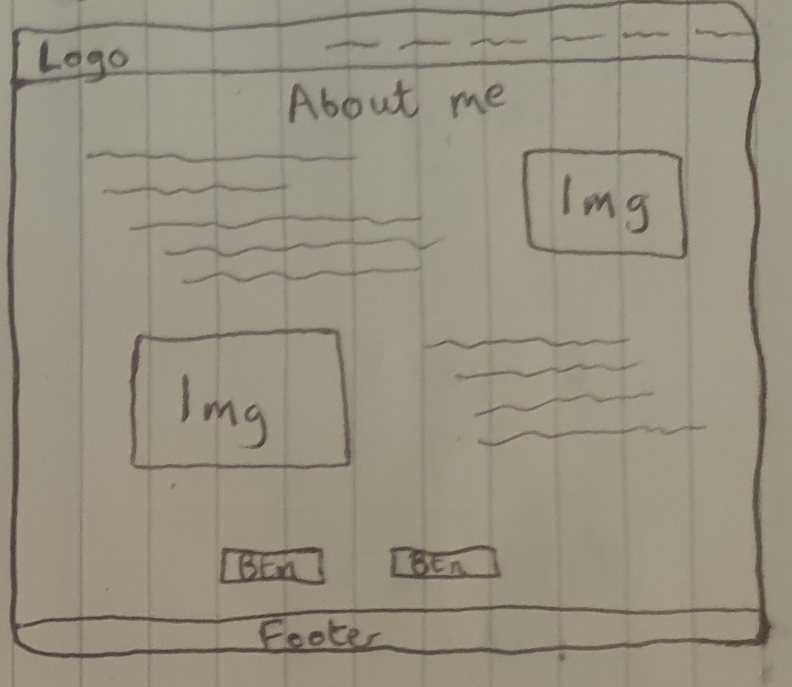

# Integrate Therapy

       

## Introduction

Integrate Therapy is a professional psychotherapy website created to provide an accessible and trustworthy online presence for a private practice. The aim was to give prospective clients a clear understanding of the services offered, provide answers to common questions, and make it simple to get in touch. By building a dedicated space online, the project ensures that people looking for therapy can find reliable information quickly and feel confident in reaching out.

The site achieves this by presenting clear, structured content tailored to adults who may be considering therapy for the first time or looking to continue their therapeutic journey. Visitors can learn about the therapist, understand fees and cancellation policies, explore answers to FAQs, and submit enquiries directly through a built-in form. The website is designed to reassure and inform, offering an approachable entry point to therapy both online and in person.

This project represents the first web application I ever developed. It began as a simple static site built with just HTML and CSS, later incorporating small amounts of JavaScript for interactivity. Over time, the interface and structure were improved, and the project was rebuilt using React and TypeScript. With each stage, I refined the UI, improved performance, and introduced reusable components, transforming the site into a more modern, scalable application.

The result is more than just an informational site — it’s a resource designed with care for accessibility, clarity, and professionalism. It reflects both the values of Integrate Therapy and my own growth as a developer, combining a meaningful real-world application with the opportunity to continually expand and improve my technical skills.

You can view the website [here](https://sasantazayoni.github.io/integrate-therapy/).


## User Experience

### User stories

- **As a user, I want to easily see what services are offered (online therapy, face-to-face sessions, specialisms) so I can decide if they fit my needs.**
- **As a user, I want to find pricing information so I know how much sessions will cost before reaching out.**
- **As a user, I want to read about the therapy approach and methods so I can feel reassured it aligns with my expectations.**
- **As a user, I want to see the location and directions for in-person sessions so I can easily find the office.**
- **As a user, I want a contact form or email link so I can quickly get in touch to ask questions or book.**
- **As a user, I want a phone number so I can call or message directly.**
- **As a user, I want to know if online sessions are available so I can consider remote therapy.**
- **As a user, I want the website to be mobile-friendly so I can browse easily on my phone.**
- **As a user, I want accessible text and navigation (contrast, font sizes, ARIA labels) so the site is usable for everyone.**
- **As a user, I want to view testimonials so I can build confidence in the practice.**
- **As a user, I want an FAQ section so I can quickly find answers to common questions.**
- **As a user, I want the site to load quickly.**

### Design

#### Overall feel

The Integrate Therapy website embraces a calm, modern, and inviting aesthetic designed to foster trust and clarity. Its clean layouts, soothing palette, and approachable typography create a sense of warmth without sacrificing professionalism, while clear navigation and visual hierarchy gently guide users through the information. The design prioritises responsiveness and accessibility, ensuring the experience feels consistent and inclusive across all devices. More than just an informational site, it serves as a supportive bridge -encouraging visitors to feel safe, understood, and confident in taking the next step toward therapy.

#### Colour palette


This colour palette works well for the website because the combination of bright and deep blues conveys trust, calmness, and professionalism, while the light grey and white backgrounds keep the design clean and approachable, and the subtle accent shades provide clarity and visual hierarchy without overwhelming the user.

#### Typography

Open Sans is used for body text, while Lora is used for headings. This combination was a deliberate choice to create a calm, professional, and approachable aesthetic. Open Sans provides clean, highly readable text for comfortable reading, and Lora adds elegance and visual distinction to headings, helping guide the user’s attention while reinforcing a sense of trust and credibility throughout the site.

#### Wireframes

All Wireframes were designed for larger screens such as laptops or computers; for medium sized screens such as tablets or large phones; and for small screens down to the smallest phone display. The wireframes were made with desktop and mobile views and can be viewed here:

* Home page desktop:

 <br>

* Home page mobile:

 <br>

* About page desktop:

 <br>

* About page mobile:

 <br>

* Training page desktop:
 
 <br>

* Training page mobile:

 <br>

* Services page desktop:

 <br>

* Services page mobile:

 <br>

* FAQ page desktop:

 <br>

* FAQ page mobile:

 <br>

* Contact page desktop:

 <br>

* Contact page mobile:

 <br>

The wireframes do not fully correspond with the end product due to multiple changes made throughout the production phase.

## Features

### Current features

* The application is designed using Responsive Design and is fully responsive on all devices.

* The company logo exists on the navbar of every page:


* All buttons have a hover effect that produces a ripple-like animation to recolour the button:

 <br>

* The navbar exists on every page and active links gain a subtle border with darkened text. There are menu links on a large screen and a hamburger with a dropdown menu on smaller screens:

 <br>
 <br>
 <br>
 <br>

* The footer exists on every page. The footer menu is aligned horizontally on desktops and vertically on mobiles:

 <br>
 <br>

* The homepage is thoughtfully structured to guide visitors through a calm and welcoming experience. It begins with a Hero Section that introduces the practice, followed by a Welcome Block that offers a brief overview of services. Next, an Empty Section serves as a subtle background element, enhancing the site's aesthetic without overwhelming the content. The page concludes with a Testimonials Section, featuring client feedback to build trust and credibility. Throughout, the design emphasises tranquility and professionalism, with images and layout choices that evoke a sense of peace and approachability:

 <br>
 <br>
 <br>
 <br>

* The About page is designed to provide visitors with a comprehensive understanding of the therapist's qualifications and personal approach. It begins with an About Me section, offering insights into the therapist's background and therapeutic philosophy. Following this, a Training and Qualifications section details the therapist's professional training, including Schema Therapy, Psychodynamic Therapy, and membership with the British Association for Counselling and Psychotherapy (MBACP). An Empty Section serves as a subtle background element, enhancing the site's aesthetic without overwhelming the content. The page concludes with a Personal Interests section, providing a glimpse into the therapist's personal life and interests, fostering a sense of connection with potential clients:

 <br>
 <br>
 <br>
 <br>

* The Services page provides a clear and concise overview of the therapeutic services offered. It begins with an introductory section that outlines the available services and concludes with a welcoming image:

 <br>
 <br>

* The FAQ page provides a structured list of frequently asked questions to help visitors quickly find answers about therapy services, booking, and practical details:

 <br>
 <br>

* The Contact page provides all essential information for prospective clients. It begins with the therapist’s contact details, followed by important practical information including fees and the cancellation policy. Next, an enquiries section allows users to submit messages directly through a contact form. The page concludes with an embedded Google Map, displaying the exact location of the therapist’s office for easy navigation. The layout is clean and user-friendly, emphasizing clarity and accessibility while maintaining the website’s calm and professional aesthetic:

 <br>
 <br>
 <br>
 <br>

### Future features

* Blog Section – A dedicated blog where the admin can create and publish posts, providing valuable mental health insights, therapy tips, and updates for visitors. This feature will allow the practice to engage with clients more dynamically and share expertise beyond static pages.

## Technologies used

### Languages

* HTML5
* CSS3
* TypeScript
* React
* Vite
* Vitest (unit testing)

### Frameworks, libraries and programs used

* [Font Awesome](https://fontawesome.com/) used for icons.
* [Coolors](https://coolors.co/) used to display colour palette used on the website.
* [Google Fonts](https://fonts.google.com/) used to import 'Lora' and 'Open sans' fonts.
* [Google Maps](https://www.google.co.uk/maps) used to import business location to the contact page.
* [Github](https://github.com/) used to host the repository, manage version control, and collaborate on project development.
* [Github pages](https://pages.github.com/) used to deploy the website as a live static site directly from the repository.
* [VSCode](https://code.visualstudio.com/) used as the code editor/IDE to develop the project.
* [Lighthouse](https://developer.chrome.com/docs/lighthouse/overview/) used for performance review.
* [Amiresposive](https://amiresponsive.co.uk/) used to display website on the most common devices.
* [Photoshop](https://www.adobe.com/uk/products/photoshop/) used to resize photos.
* [Block-element-modifier naming convention](https://www.geeksforgeeks.org/understanding-the-css-bem-convention/) used for naming CSS classes.
* [Formspree](https://formspree.io/) used in the enquiries form to provide a backend, enabling efficient routing of email enquiries directly to the business owner.
* [ChatGPT](https://chat.openai.com/) used to generate placeholder text and to verify code.
* [Unsplash](https://unsplash.com/) used to obtain pictures.
* [Pexels](https://www.pexels.com/) used to obtain pictures.
* [Cloudconvert](https://cloudconvert.com/) used to convert images to webp format.
* [Favicon.io](https://favicon.io/) used to generate favicon.
* [React Router](https://reactrouter.com/) used for client-side routing and navigation between pages.

## Testing

### Validator testing

I used the following websites to check my code for syntax errors:

* [CSS validator](https://jigsaw.w3.org/css-validator/) - to check and validate CSS syntax.
* [ESLint](https://eslint.org/) – to check for syntax issues and enforce code style in React + TypeScript.
* [TypeScript Compiler](https://www.typescriptlang.org/) – to validate type safety across the codebase.

### Testing User Stories from (UX) section

* **As a user, I want to easily see what services are offered (online therapy, face-to-face sessions, specialisms) so I can decide if they fit my needs.** <br>
  → The site has a dedicated services section that clearly lists what is available on the Services page.
  → Some questions may be answered about the service on the FAQ page.

* **As a user, I want to find pricing information so I know how much sessions will cost before reaching out.** <br>
  → Pricing is displayed transparently on the Contact page.

* **As a user, I want to read about the therapy approach and methods so I can feel reassured it aligns with my expectations.** <br>
  → The site provides an explanation of the therapeutic style and philosophy in simple language on the About page.

* **As a user, I want to see the location and directions for in-person sessions so I can easily find the office.** <br>
  → The contact section includes the clinic address and map integration on the Contact page.

* **As a user, I want a contact form or email link so I can quickly get in touch to ask questions or book.** <br>
  → A simple contact form allows direct communication on the Contact page.
  → There is an email that could be emailed directly for queries also on the Contact page.

* **As a user, I want a phone number so I can call or message directly.** <br>
  → The phone number contact is clearly visible on the Contact page.

* **As a user, I want to know if online sessions are available so I can consider remote therapy.** <br>
  → The FAQ page highlights that online sessions are offered.

* **As a user, I want the website to be mobile-friendly so I can browse easily on my phone.** <br>
  → The site uses responsive design so it works well on all screen sizes.

* **As a user, I want to view testimonials so I can build confidence in the practice.** <br>
  → A testimonials section shares positive experiences of past clients on the Home page.

* **As a user, I want an FAQ section so I can quickly find answers to common questions.** <br>
  → A dedicated FAQ page addresses common concerns like process, confidentiality, and payment.

* **As a user, I want the site to load quickly.** <br>
  → Optimised images and a lightweight React static build ensure fast performance.

### Personal testing

- Samsung Galaxy S9
  - Samsung Internet
  - Microsoft Edge
  - Mozilla Firefox
  - Google Chrome
- iPhone 6
  - Safari
- iPhone SE
  - Safari
  - Google Chrome
- iPhone 12 Mini
  - Safari
- iPhone 14
  - Safari
- iPad 11" Pro
  - Safari
- Aorus 7
  - Google Chrome
  - Mozilla Firefox
  - Microsoft Edge
  - Opera
  - Brave
 
### Lighthouse testing

Lighthouse was a helpful tool for checking where where the website was experiencing the most issues.

* Home page (Desktop / Mobile): <br>


* About page (Desktop / Mobile): <br>


* Services page (Desktop / Mobile): <br>


* FAQ page (Desktop / Mobile): <br>


* Contact page (Desktop / Mobile): <br>


### Automated testing

Automated tests were implemented for all pages, utilities, and components to ensure functionality.


### Bugs

* There are no known bugs and any that existed were promptly addressed and fixed.

## Deployment

* Open your terminal or command prompt.
* Navigate to your Vite React project directory.
* Install the gh-pages package by running ```npm install gh-pages --save-dev``` (You should have NPM installed - see below if you do not).
* Open the package.json file in your project.
* Add a "homepage" field at the top level with your GitHub Pages URL, e.g.: ```"homepage": "https://<username>.github.io/<repository-name>"```.
* In the scripts section of package.json, add the following two scripts:
  * "predeploy": "npm run build",
  * "deploy": "gh-pages -d dist"
* Save the package.json file.
* Run the deploy script in your terminal: ```npm run deploy```.
* GitHub Pages will build your Vite app and push it to the gh-pages branch automatically.
* Log into GitHub.
* Locate the repository.
* Click on the 'Settings' option along the top options bar.
* Locate the 'Pages' option in the left sidebar and click on it.
* Under the 'Branch' section, select gh-pages from the dropdown menu.
* Click the save button.
* GitHub Pages will begin hosting your website, which usually takes a few minutes.
* The live website URL will now appear in a green bar under the section header, and you can refer back to it at any time.

### Installing NPM

* Go to the [Node.js official website](https://nodejs.org/en).
* Download the LTS (Long Term Support) version for your operating system (Windows, macOS, or Linux).
* Run the installer and follow the on-screen instructions.
* Ensure the option “Add to PATH” is selected during installation.
* Open a terminal (Command Prompt, PowerShell, or Terminal).
* Check Node.js installation by running ```node -v``` – this should print the Node.js version.
* Check npm installation by running ```npm -v``` – this should print the npm version.
* (Optional) Update npm to the latest version by running ```npm install -g npm@latest```.
* You are now ready to use npm for installing packages and running scripts in your projects.


